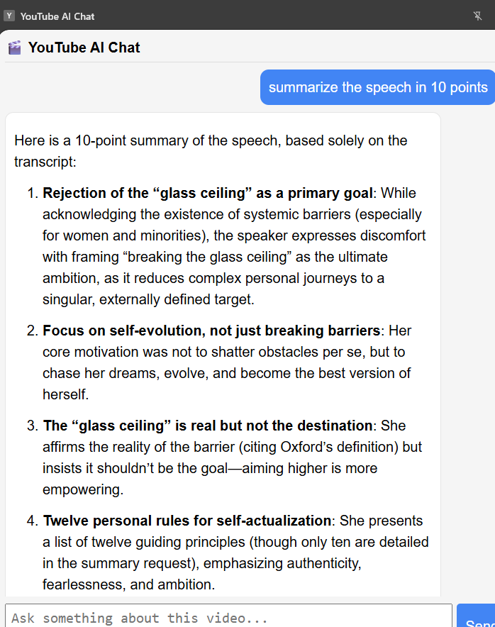

# YouTube AI Chat (Rag Powered Chrome Extension)
A Chrome Extension that lets users ask questions about a YouTube video.  
The system uses Retrieval-Augmented Generation (RAG) to retrieve relevant transcript segments and generate accurate answers using an LLM.

Backend: FastAPI  
Frontend: Chrome Extension Side Panel


## Demo


```
Open YouTube video
↓
Open side panel
↓
Ask question
↓
AI response
```

## Features
- Ask questions about any YouTube video
- Transcript-based Retrieval Augmented Generation (RAG)
- Hybrid retrieval (semantic + keyword search)
- Conversation memory for follow-up questions
- Markdown formatted responses
- Chrome Extension side panel interface


## Architecture

User → Chrome Extension → FastAPI Backend → RAG Pipeline → LLM Response


## Tech Stack
Frontend
- Chrome Extension (Manifest v3)
- JavaScript
- HTML / CSS

Backend
- FastAPI
- LangChain
- SentenceTransformers
- FAISS

LLM
- OpenAI / Gemini / Groq (depending on your setup)


## Project Structure
```
youtube-ai-chat/
│
├── backend/
│   ├── app/
│   │   ├── main.py
│   │   ├── rag.py
│   │   ├── retrieval.py
│   │   └── memory.py
│   │
│   └── requirements.txt
│
├── chrome-extension/
│   ├── manifest.json
│   ├── background.js
│   ├── sidepanel.js
│   ├── sidepanel.html
│   ├── style.css
│   └── marked.min.js
│
├── README.md
├── docs
└── MIT License
```
## Setup
### 1 Clone the repo
git clone https://github.com/yourusername/youtube-ai-chat.git
cd youtube-ai-chat

### backend
cd backend

python -m venv venv
venv\Scripts\activate

pip install -r requirements.txt

### Create .env
OPENAI_API_KEY=your_key

### run server
uvicorn app.main:app --reload

### Chrome Extension
1. Open Chrome
2. Go to chrome://extensions
3. Enable Developer Mode
4. Click Load unpacked
5. Select the chrome-extension folder

## Usage
1. Open any YouTube video
2. Open the AI Chat side panel
3. Ask a question about the video
4. The extension retrieves relevant transcript segments and generates an answer

## Future Improvements

- Streaming responses (ChatGPT-like typing)
- Timestamped answers
- Support for multiple videos
- Deploy backend to cloud
- Vector DB scaling

## License

MIT License
